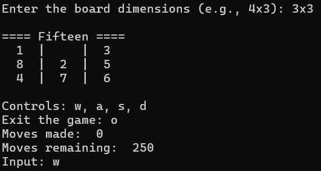
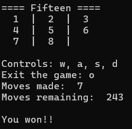
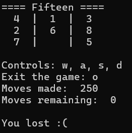

# Fifteen Game

## Introduction

Fifteen is a simple puzzle game where the objective is to arrange all the numbers from left to right and top to bottom on a board of dimensions NxM, which always has one empty cell. The player can move the tiles in different directions using the empty space.

The game is won when all elements are ordered from left to right, with the empty cell located in the bottom-right corner.

## Features

- Arrange numbers on an NxM board.
- Move tiles in four directions: `'w'` (up), `'a'` (left), `'s'` (down), `'d'` (right).
- Exit the game with `'o'`.

## Instructions

### Prerequisites

- Python 3.x

### Running the Game

```sh
cd fifteen
python main.py
```

### Gameplay
- Use the keys `'w'`, `'a'`, `'s'`, `'d'` to move tiles.
- Press `'o'` to exit the game.

## Game Screenshots
### Initial State


### Game Start


### Game Won


### Game Lost


## Code Explanation
### main.py
- `main()`: The main function that initializes the game, handles user inputs, and checks the game state.
### logic.py
- `format_dimensions(dimensions)`: Formats and validates the input dimensions.
- `create_matrix(board_dimensions)`: Creates and shuffles the game matrix.
- `display_game(matrix, moves, move_limit)`: Displays the current state of the game.
- `move(direction, matrix)`: Moves the tiles based on the user's input.
- `locate_empty(matrix)`: Locates the empty cell in the matrix.