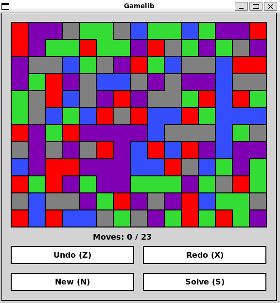
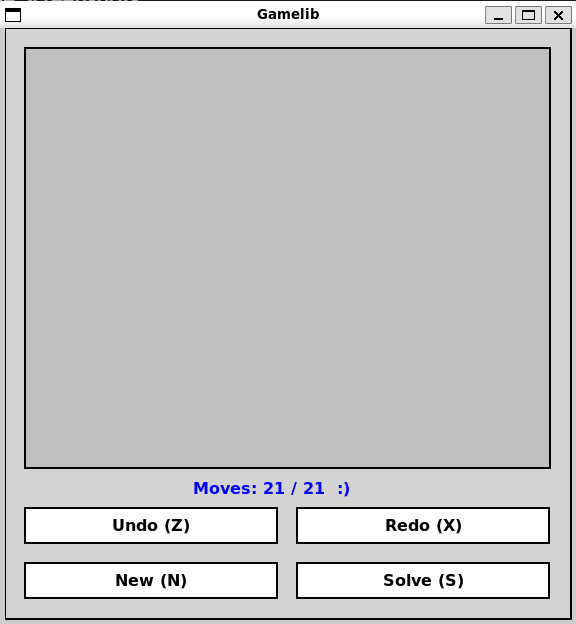
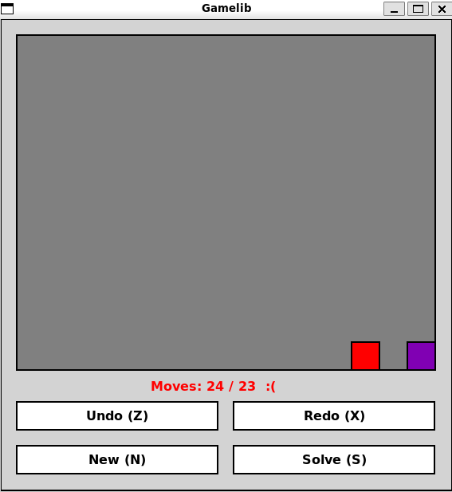

# Flood Game

## Introduction

Flood is a puzzle game where the objective is to change the colors of the cells in a grid to make all cells the same color. You start from the top-left corner and can change the color of contiguous blocks of the same color.

## Features

- Randomly generated grids with multiple colors.
- Change colors to match adjacent blocks.
- Undo and redo moves.
- Display the optimal number of moves.

## Instructions

### Prerequisites

- Python 3.x

### Running the Game

```sh
cd flood
python main.py
```

### Gameplay
- Click on a color in the grid to change the color of the connected block starting from the top-left corner.
- Use the buttons or keyboard shortcuts to undo (Z), redo (X), create a new game (N), or calculate the solution (S).

## Game Screenshots
### Game Start


### Game Won


### Game Lost


## Code Explanation
### main.py
- `main()`: The main function that initializes the game, handles user inputs, and updates the display.
### game/flood.py
- `Flood`: Class to manage the grid and color changes.
- Methods for generating, shuffling, and manipulating the grid.
### game/flood_game.py
- `FloodGame`: Class to manage the game state, including moves, undo/redo functionality, and solving the puzzle.
### game/queue.py
- `Queue`: Implementation of a queue data structure used in the game.
### game/stack.py
- `Stack`: Implementation of a stack data structure used in the game.