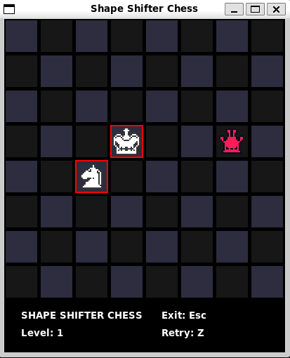
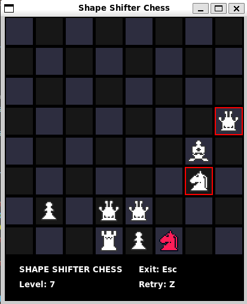

# Shape Shifter Chess

## Introduction

Shape Shifter Chess is a chess-based puzzle game where pieces change their type and move differently. The objective is to navigate the board and eliminate other pieces by transforming into different chess pieces.

## Features

- Randomly generated board setup.
- Pieces transform and move according to chess rules.
- Save and load game state.

## Prerequisites

- Python 3.x
- Tkinter

### Running the Game

```sh
cd shape-shifter-chess
python main.py
```

### Gameplay
- Click on a piece to select it. Valid moves are highlighted.
- Use the mouse to move pieces.
- Press Esc to exit the game.
- Press Z to retry the level.

## Game Screenshots
### Game Start (Level 1)

### Advanced Level (Level 7)


## Code Explanation
### main.py
- `main()`: Contains functions for loading and saving the game, updating the game state, and managing the pieces and their movements, and the main function that initializes the game, handles user inputs, and updates the display.
### libs/linked_list.py
- `LinkedList`: Implementation of a linked list data structure used in the game.

### Images
The `images` folder contains images for the different chess pieces in both red and white colors.